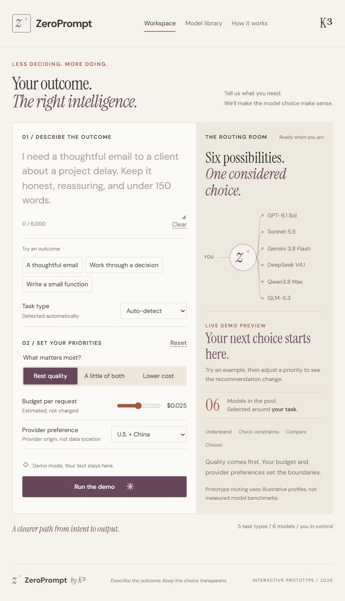

# ZeroPrompt

### Describe the outcome. Let the model choice make sense.

ZeroPrompt is an interactive prototype developed as one of my undergraduate university projects for an **Artificial Intelligence** course. It explores a simple question: **can an AI assistant make model selection easier for everyday users while keeping its choices understandable?**

The project presents the K³ model-routing proposal through a working browser demo. Users describe an outcome, set their priorities, and explore how a router could choose between models from U.S. and Chinese providers.

**Status:** course-project prototype with simulated routing and prepared responses. No live AI API integration.

**[Open the live demo](https://pshkai.github.io/zeroprompt/)**



## The idea

Choosing an LLM can involve trade-offs between task suitability, quality, cost, and response time. ZeroPrompt puts the user's intended outcome first, then makes the selection process visible: which candidates qualify, why one is selected, and how the alternatives compare.

This prototype supports discussion and demonstration of the proposed approach. It does not establish that one provider or model performs better than another.

## What the demo includes

- An outcome editor with writing, decision-making, and coding examples.
- Five task categories: writing, summarization, reasoning, coding, and synthesis, with automatic detection and a manual override.
- Quality, balanced, and lower-cost priorities.
- A per-request budget, provider-origin preferences, and individual model switches.
- An instant recommendation preview and animated, cancellable routing sequence.
- Selection explanations, a next-best comparison, and eligibility details for all six candidates.
- Prepared sample responses with copy and text-download controls.
- A model library and a view explaining the routing process.
- Responsive layouts, keyboard focus styles, and reduced-motion support.

## Run locally

You need Git and Python 3. There are no application dependencies or build steps.

```sh
git clone https://github.com/pshkai/zeroprompt.git
cd zeroprompt
python -m http.server 8765 --bind 127.0.0.1 --directory dist
```

Open **http://127.0.0.1:8765/** in your browser. If your system uses `python3` instead of `python`, substitute that command. Any static HTTP server can serve the `dist/` directory.

## Try a short walkthrough

1. Choose **A thoughtful email** in the workspace.
2. Change the priority from **Best quality** to **Lower cost** and inspect the recommendation.
3. Adjust the budget or provider preference to see which candidates remain eligible.
4. Select **Run the demo**, then review the explanation and compare all six models.
5. Open **Model library**, disable a candidate, and return to the workspace to explore another route.

## How it works

The browser classifies the request using simple local rules, or uses the task category selected by the user. It filters candidates by enabled models, provider preference, and estimated budget, then ranks eligible candidates using a weighted combination of illustrative task fit, cost, and completion time.

The selected model and its alternatives are displayed with explanations. The response is a prepared example for the task category; it is not generated from the user's request.

## Technology and structure

Built with HTML, CSS, and vanilla JavaScript. The visual design uses warm paper tones, plum and clay accents, restrained motion, and the italic z° identity.

```text
zeroprompt/
├── dist/
│   ├── index.html     # Workspace, model library, and explanation views
│   ├── style.css      # Visual design, responsive layout, and animation
│   ├── app.js         # Local routing simulation and interactions
│   └── favicon.svg
├── docs/
│   └── preview.png
└── README.md
```

## Academic context and limitations

This is an undergraduate Artificial Intelligence course project, intended to demonstrate a system concept and support further experimentation.

- Model profiles, quality scores, and completion times are illustrative fixtures, not benchmark measurements.
- Model names and displayed prices reflect the project's proposal data and should not be treated as a current provider catalog or pricing reference.
- Estimated request costs use simplified token assumptions; the demo does not incur model usage charges.
- Provider origin does not indicate where data would be processed or stored.
- User input stays in browser memory. There is no backend, account system, analytics, or persistent prompt storage.
- Typography loads from Google Fonts, so the page is not fully offline. Prompt text is not sent to that service.
- No API keys are required, and no AI provider is contacted by the demo.

## Possible next steps

Future course work could evaluate routing against fixed-model baselines using a defined task dataset, measure quality/cost/latency trade-offs, and study whether explanations help users understand model selection. Live provider integration would require a separate server-side gateway and appropriate privacy and security controls.

These are proposed extensions, not implemented features or completed research findings.

## Project author

Created by [pshkai](https://github.com/pshkai) as part of undergraduate study in Artificial Intelligence. The prototype carries the **K³ research edition** identity.

The demo is hosted on GitHub Pages. Changes to `main` deploy the static `dist/` directory through GitHub Actions.
